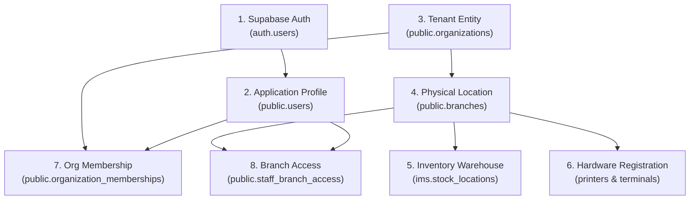

# CloudPOS Master Onboarding Guide
**Applicable Applications:** `POS-v2` (Terminal), `ADMIN-v2` (Back-Office), `IMS-v1` (Inventory Management System)  
**Target Environment:** Production (`djkvjhlwsjjzkqurfmls`) & Staging/Local  

---

## 1. Executive Summary & Architectural Context

CloudPOS utilizes a **Shared Database, Shared Schema** multi-tenant architecture on Supabase (PostgreSQL). Data isolation and access control are rigorously enforced through Row-Level Security (RLS) policies driven by two core relational keys:
* `organization_id` (UUID): Represents the tenant / legal business entity.
* `branch_id` (UUID): Represents the physical or virtual branch location.

To onboard a new tenant (Organization), store location (Branch), inventory warehouse (Stock Location), terminal hardware, and user personnel, operations must follow a **strict sequential order**. Deviation from this sequence will trigger foreign-key constraint failures or leave users with incomplete RLS permissions, causing "Access Denied", empty dashboards, or branch selection errors.

---

## 2. Mandatory Onboarding Sequence Overview



---

## 3. Step-by-Step Provisioning Specification

### Step 1: User Authentication Setup
Create the identity credential in Supabase Auth (via Supabase Dashboard, Auth Admin API, or Edge Function).
* **Target Table:** `auth.users` (managed by GoTrue)
* **Critical Action:** Record the generated User ID (`auth_user_id` UUID). All subsequent user grants rely on this exact UUID.
* **Security Rule:** Never store role authorization claims in `raw_user_meta_data` (as users can modify it). If using custom claims for super-admin privileges, set them in `raw_app_meta_data`.

### Step 2: User Profile Creation
Register the application-level display profile. Note that `public.users` does **not** contain a `role_id` column — the user's application role is assigned later via the `organization_memberships` table (Step 5).
* **Target Table:** `public.users`
* **Available Columns:** `id`, `email`, `name`, `is_active`, `totp_enabled`, `totp_secret`, `pin_code`, `failed_auth_attempts`, `auth_lockout_until`.
* **SQL Template:**
  ```sql
  INSERT INTO public.users (id, email, name, is_active, totp_enabled, failed_auth_attempts)
  VALUES (
    '<AUTH_USER_ID>', 
    'user@store.com', 
    'John Doe', 
    true, 
    false, 
    0
  );
  ```

> [!IMPORTANT]
> **No Auto-Creation Trigger:** There is no trigger that auto-creates a `public.users` row from `auth.users`. This row **must** be inserted manually or via the onboarding Edge Function. If missing, the user will see a blank dashboard.

### Step 3: Organization (Tenant) Registration
Create the root tenant entity.
* **Target Table:** `public.organizations`
* **Required Fields:**
  * `legal_name`: Official business commercial registration name.
  * `trade_name`: Public brand name displayed on receipts and terminal headers.
  * `country_code`: ISO alpha-2 country code (default: `'AE'`).
  * `status`: Set to `'active'`.
* **SQL Template:**
  ```sql
  INSERT INTO public.organizations (id, legal_name, trade_name, country_code, status)
  VALUES (
    gen_random_uuid(), -- Record this <ORGANIZATION_ID>
    'Global Food Corporation LLC', 
    'Downtown Cafe', 
    'AE', 
    'active'
  ) RETURNING id;
  ```

### Step 4: Branch (Location) Creation
Every physical store, kiosk, or food truck must be registered under the organization.
* **Target Table:** `public.branches`
* **Required Fields:**
  * `organization_id`: Parent `<ORGANIZATION_ID>`.
  * `name`: Descriptive branch name (e.g., "Dubai Mall Store").
  * `branch_code`: Short code prefix for transactional reporting (e.g., "DMS").
  * `status`: Set to `'active'`.
* **SQL Template:**
  ```sql
  INSERT INTO public.branches (id, organization_id, name, branch_code, status)
  VALUES (
    gen_random_uuid(), -- Record this <BRANCH_ID>
    '<ORGANIZATION_ID>', 
    'Dubai Mall Store', 
    'DMS', 
    'active'
  ) RETURNING id;
  ```

### Step 5: Organization Membership Grant
Access to organization data is governed by tenant RLS policies calling `public.is_org_member(organization_id)`. Without an active membership record, users cannot access any product catalog, customers, or orders.

This table is also where the **application role** (`role_id`) is assigned to the user within the context of the organization.
* **Target Table:** `public.organization_memberships`
* **Required Fields:**
  * `organization_id`: `<ORGANIZATION_ID>`
  * `user_id`: `<AUTH_USER_ID>`
  * `member_type`: Must be one of the values defined by the DB CHECK constraint:
    * `'staff'` — Standard employee (requires explicit branch access via Step 6).
    * `'owner'` — Business owner (auto-bypasses branch-level checks in `has_branch_access()`).
    * `'partner'` — Business partner.
    * `'investor'` — Investor stakeholder.
    * `'auditor'` — Auditor (auto-bypasses branch-level checks in `has_branch_access()`).
  * `role_id`: UUID from `public.app_roles` — determines app-level permissions:
    * `Admin` (`level: 100`): Access to `pos`, `admin`, `ims`.
    * `Manager` (`level: 50`): Access to `pos`, `admin`, `ims`.
    * `Cashier` (`level: 10`): Access to `pos` only.
    * `Owner` (`level: 999`): Unrestricted across all apps.
  * `status`: Set to `'active'` (only other valid value: `'revoked'`).
* **Unique Constraint:** `(organization_id, user_id)` — a user can only have one membership per org.
* **SQL Template:**
  ```sql
  INSERT INTO public.organization_memberships (organization_id, user_id, member_type, role_id, status)
  VALUES (
    '<ORGANIZATION_ID>',
    '<AUTH_USER_ID>',
    'staff', -- or 'owner' / 'partner' / 'investor' / 'auditor'
    '<ROLE_ID>',
    'active'
  );
  ```

> [!WARNING]
> **`'admin'` is NOT a valid `member_type`.** Using `'admin'` will violate the `organization_memberships_member_type_check` constraint. To grant admin-level app permissions, use `member_type = 'staff'` with `role_id` pointing to the `Admin` app_role (level 100).

### Step 6: Staff Branch Access Grant
For personnel with `member_type = 'staff'`, the system enforces strict **Branch-Level Isolation**. Even if they are valid members of the organization, they cannot open shifts or view sales in a terminal unless granted explicit branch authorization.
* **Target Table:** `public.staff_branch_access`
* **Note:** Users with `member_type IN ('owner', 'auditor')` automatically bypass this check in SQL (`public.has_branch_access()`), but staff personnel require an explicit row.
* **SQL Template:**
  ```sql
  INSERT INTO public.staff_branch_access (organization_id, user_id, branch_id, status)
  VALUES (
    '<ORGANIZATION_ID>',
    '<AUTH_USER_ID>',
    '<BRANCH_ID>',
    'active'
  );
  ```

### Step 7: Inventory Warehouse & Opening Ledger Setup
To prevent POS checkout failures during stock depletion calculations, an inventory stock location must be assigned to the branch.
* **Target Table:** `ims.stock_locations`
* **Required Fields:**
  * `organization_id`: `<ORGANIZATION_ID>`
  * `branch_id`: `<BRANCH_ID>`
  * `code`: Unique warehouse code (e.g., "DMS-ST-001").
  * `kind`: Set to `'store'` (or `'warehouse'`).
  * `is_active`: `true`.
* **SQL Template:**
  ```sql
  INSERT INTO ims.stock_locations (id, organization_id, branch_id, code, name, kind, is_active)
  VALUES (
    gen_random_uuid(), -- Record this <STOCK_LOCATION_ID>
    '<ORGANIZATION_ID>',
    '<BRANCH_ID>',
    'DMS-ST-001',
    'Main Branch Store',
    'store',
    true
  );
  ```
* **Best Practice Tip:** After inserting the stock location, perform an "Opening Balance" credit entry in `ims.inventory_ledger` for initial stock items.

### Step 8: Hardware Registration (POS Terminals & Printers)
POS hardware must be bound to both the tenant and branch to enable local kiosk locking and receipt routing.
* **Target Tables:** `public.terminals` and `public.printers`
* **SQL Template (Terminals):**
  ```sql
  INSERT INTO public.terminals (organization_id, branch_id, terminal_code, device_type, status)
  VALUES (
    '<ORGANIZATION_ID>',
    '<BRANCH_ID>',
    'TERM-01',
    'iPad / POS Desktop',
    'active'
  );
  ```
* **SQL Template (Printers):**
  ```sql
  INSERT INTO public.printers (organization_id, branch_id, name, type, status, is_default)
  VALUES (
    '<ORGANIZATION_ID>',
    '<BRANCH_ID>',
    'Front Counter Thermal',
    'receipt', -- or 'kitchen'
    'connected',
    true
  );
  ```

---

## 4. RLS & Frontend Context Pattern

### Database RLS Helper Functions
The Postgres engine verifies access on every query using two primary helper functions:
1. `public.is_org_member(p_organization_id uuid)`: Verifies if the active `auth.uid()` has a valid `'active'` entry in `public.organization_memberships` (or checks session variable `app.current_organization_id` cache).
2. `public.has_branch_access(p_organization_id uuid, p_branch_id uuid)`: Verifies if `p_branch_id` is null, or if the user is an owner/auditor, or has an active entry in `public.staff_branch_access`.

### Frontend React Context Behavior
In both `POS-v2` and `ADMIN-v2`, application state is governed by:
* `OrganizationContext`: Queries `organization_memberships` (filtered by `user_id = auth.uid()` and `status = 'active'`) with a **join to `organizations`** to fetch the org details (id, legal_name, trade_name, tax_number, status). The selected org is persisted in `localStorage` (`last_organization_id`). Also exposes the user's `member_type` from the membership record.
* `BranchContext`: Fetches branches for the active organization subject to staff access rules, persists selection in `localStorage` (`last_branch_${organization_id}`), and supplies `currentBranchId` for order and shift creation.

---

## 5. ⚠️ Critical Troubleshooting: JWT Session Staleness

> [!CAUTION]
> **The #1 Support Issue During Onboarding: Stale JWT Tokens**
> If an administrator assigns a user to a new organization or grants new branch access in `public.organization_memberships` / `public.staff_branch_access` while the target user is **currently logged into the app**, their active JWT access token and client memory state will NOT immediately reflect these database additions.
>
> **Symptoms Observed by User:**
> * "Required field: Branch" validation errors during transaction attempts.
> * Blank screens or "Access Denied" alerts when switching branches.
> * Dropdown lists appearing completely empty despite records existing in PROD.
>
> **Mandatory Resolution Procedure:**
> Instruct the user to explicitly click **Sign Out** and then **Sign In** again. This discards the old session, forces an authentication handshake with Supabase, refreshes session metadata, and re-evaluates all RLS helper functions with clean cache.

---

## 6. Onboarding Verification Checklist

When provisioning a client, verify every item before handing off credentials:
- [ ] **Auth Identity:** User created in Supabase Auth (`auth.users`), UUID noted.
- [ ] **App Profile:** Row created in `public.users` with proper role assigned.
- [ ] **Tenant Record:** Organization created in `public.organizations` (`status = 'active'`).
- [ ] **Branch Record:** Branch created in `public.branches` (`status = 'active'`).
- [ ] **Tenant Grant:** Row inserted into `public.organization_memberships` linking user and org.
- [ ] **Branch Grant:** Row inserted into `public.staff_branch_access` linking user and branch (required for staff).
- [ ] **Inventory:** Stock location created in `ims.stock_locations` (`kind = 'store'`).
- [ ] **Hardware:** POS terminals and receipt printers registered in `public.terminals` & `public.printers`.
- [ ] **Session Clean:** Target user performs a fresh login *after* all records are provisioned.
